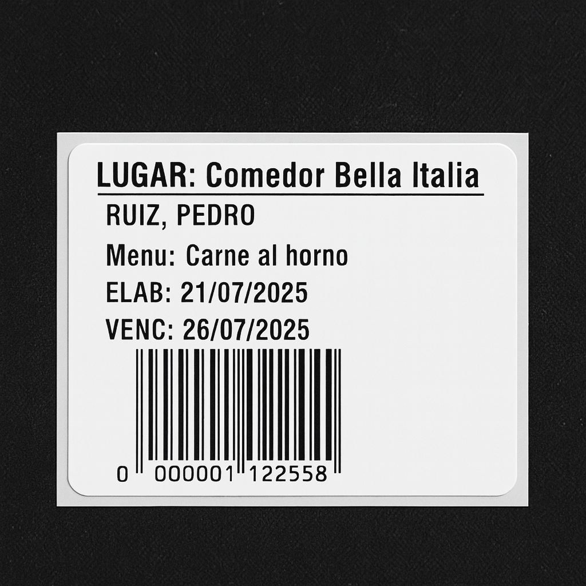

# 🖨️ Etiquetador de Viandas Zebra

Aplicación de escritorio desarrollada en Python que permite generar e imprimir etiquetas adhesivas para viandas de comida usando impresoras Zebra (ZPL).  
Lee un archivo Excel con los pedidos de menú por empleado y genera automáticamente etiquetas con nombre, menú, fechas y código de barras EAN13.

---

## 📸 Capturas de pantalla

### Interfaz principal de la aplicación


### Ejemplo de etiqueta generada


---

## ⚙️ Tecnologías utilizadas

- Python 3
- Tkinter (interfaz gráfica)
- Pandas (lectura de Excel)
- ZPL (lenguaje de etiquetas Zebra)
- Pywin32 (impresión en Windows)

---

## 🚀 ¿Cómo se usa?

1. **Cloná el repositorio**
   ```bash
   git clone https://github.com/TU_USUARIO/etiquetador-viandas-zebra.git
   cd etiquetador-viandas-zebra
   ```

2. **Creá un entorno virtual y activalo**
   ```bash  
   python -m venv venv
   .\venv\Scripts\activate
   ```

3. **Instalá las dependencias**
   ```bash
   pip install -r requirements.txt
   ```

4. **Ejecutá la aplicación**
   ```bash
   python etiquetador.py
   ```

---

## 📦 Versión compilada incluida

Este proyecto ya incluye una versión compilada lista para usar.

🔹 Si estás en Windows, podés ejecutar directamente el archivo:

```
dist/Etiquetador.exe
```

No es necesario tener Python instalado ni configurar dependencias.  
Simplemente abrí el ejecutable y comenzá a imprimir etiquetas.

> 📁 Asegurate de mantener todos los archivos necesarios (como `upc.ico`) en la misma carpeta si vas a mover el ejecutable.

---

## 📄 Formato esperado del Excel

La aplicación espera un archivo `.xlsx` con las siguientes columnas:

- **Nombre y apellido**
- **Nombre empleado**
- **Lugar**
- **Menú**
- **Código del menú** (obligatorio, usado para generar el código de barras)

---

## ✅ Características

- Lectura automática de pedidos desde Excel
- Cálculo de fechas de elaboración y vencimiento
- Generación de etiquetas en ZPL listas para imprimir
- Diseño de etiqueta moderno y profesional
- Compatible con impresoras Zebra como la GK420d

---

## 🙋 Autor

**Luis Miraglio** – [www.linkedin.com/in/luismiraglio](https://www.linkedin.com/in/luismiraglio)

Desarrollador Python & Automatización

---

## 📝 Licencia

Este proyecto puede usarse y adaptarse libremente dentro del entorno de trabajo.
